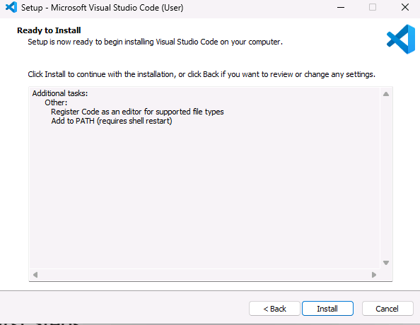
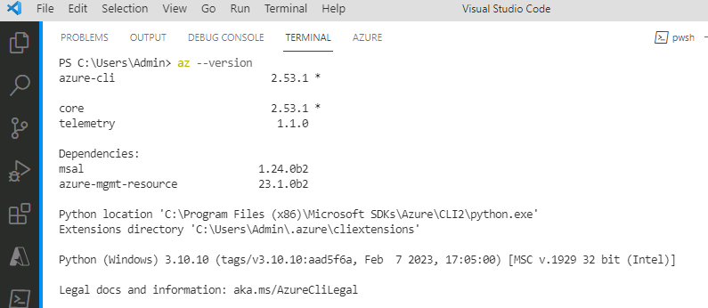
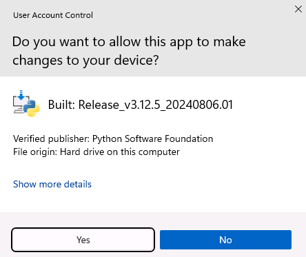
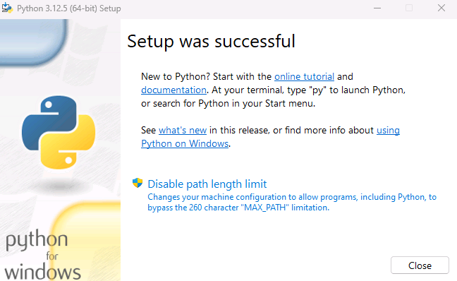

# Exercise 01 - Install client tools
<!--- Estimated time: 60 minutes--->

To complete this lab, several tools must be available on your machine. In this exercise, you will determine which resources are already available and the versions for the resources. You will install tools or upgrade tools as necessary.

Estimated time to complete this exercise: *60 minutes*

#### **What you will learn**

After completing the tasks in this exercise, you will be able to:

- Identify Azure regions that support the resources that you need
- Install and run Visual Studio Code
- Determine the version of PowerShell present on a machine and upgrade PowerShell
- Determine the version of the PowerShell Az module present on a machine and install the module if necessary
- Determine the version of Azure CLI present on a machine and install Azure CLI if necessary
- Determine the version of the Azure CLI Bicep extension present on a machine and install the extension if necessary
- Determine the version of Git present on a machine and install Git if necessary
- Determine the version of Python present on a machine and install Python if necessary
- Determine the version of Docker Desktop present on a machine and install Docker Desktop if necessary

---

# Task 01 - Select a region for deploying Azure resources and create a resource group

<!--- Estimated time: 5 minutes--->

## Introduction

You will work with the GPT-4o and Text-Embedding-ADA-002 models in this lab. This limits the number of regions you can use for deployment.

## Description

In this task, you will select a region that has support for the services that the lab requires and you will create a resource group in that region.

The key steps are as follows:

1. Review reference articles that display information about which regions support Azure AI services and which AI models are available in each region.
1. Select a region to deploy Azure resources.
1. Create a resource group named *ContosoHotel* in the selected region.

## Success Criteria

- You have created a resource group in an Azure region that supports Azure AI services and the required AI models 

## Learning Resources

- [**Support for Azure AI Services**](https://azure.microsoft.com/en-us/explore/global-infrastructure/products-by-region/?products=cognitive-services)
- [**Region availability table for AI models**](https://learn.microsoft.com/azure/ai-services/openai/concepts/models#model-summary-table-and-region-availability)

## Solution

<details markdown="block">
<summary>Expand this section to view the solution</summary>

 Review the [support for Azure AI Services](https://azure.microsoft.com/en-us/explore/global-infrastructure/products-by-region/?products=cognitive-services) to identify regions where you can deploy Azure resources required by the lab. 

1. Review the [region availability table](https://learn.microsoft.com/azure/ai-services/openai/concepts/models#model-summary-table-and-region-availability) to identify regions that support both GPT-4o and Text-Embedding-ADA-002 models. 

1. Select an Azure region where you will deploy resources. 

1. Open a browser window and go to the [Azure portal](https://portal.azure.com/). Sign in using your credentials.

1. In the Search field on the Home page, enter and select **Resource groups**. 

1. Select **Create**. 

1. In the Resource group field, enter **ContosoHotel**. In the Region field, select the region where you will deploy resources.

1. Select **Review + create** and then select **Create**.

</details>

---

# Task 02 - Install and update Visual Studio Code 

<!--- Estimated time: 5 minutes---> 

## Introduction

Visual Studio Code (VS Code) is a free, open-source code editor developed by Microsoft. It is highly popular among developers due to its versatility and extensive feature set. You will use Visual Studio Code throughout this lab to view and modify files and to run commands.

 {: .note }
 > It is important that you check for and install any updates for Visual Studio Code. Some of the extensions that you will use in this lab require the latest version of Visual Studio Code.

## Description

In this task, you will you will determine whether Visual Studio Code is installed on your machine and install the tool if necessary. You will also check to ensure that the latest version of Visual Studio Code is installed.

The key steps are as follows:

1. Identify whether Visual Studio Code is installed on your machine.
1. Check for updates and install updates if necessary.
1. Launch Visual Studio Code as an administrator.

## Success Criteria

- Visual Studio Code is installed and updated. 
- You have launched Visual Studio Code as an administrator.

## Learning Resources

- [**Introduction to Visual Studio Code**](https://learn.microsoft.com/en-us/training/modules/introduction-to-visual-studio-code/)

## Solution

<details markdown="block">
<summary>Expand this section to view the solution</summary>
  
1. On the Task Bar for your machine, search for **Visual Studio Code**.

1. In the Search results, select **Visual Studio Code** to open the app. Then, on the menu bar, select **Help** and then select **Check for Updates**. Follow instructions to install any updates. If you do not have the option, you will need to Download and install it using the below steps.

	{: .warning }
	> If Visual Studio Code is up-to-date, skip the remaining steps in this task and move to the next task. Otherwise, complete the following steps to install Visual Studio Code.

1. Open a web browser and go to [**Download Visual Studio Code**](https://code.visualstudio.com/Download). 

    

1. Select **Windows**. The app installer should start downloading immediately.

    

1. When the download completes, select **Open file**.

    

1. On the Setup page, select **I accept the agreement** and then select **Next** twice. Select **Install**. Wait while the app installs.

    

1. When installation completes, clear the **Launch Visual Studio Code** checkbox and select **Finish**. 

	{: .warning }
	> If you do not clear the checkbox Visual Studio Code will launch as a standard user. Some actions in the following tasks will not succeed if you are not running Visual Studio Code as an administrator. Follow the remaining steps in this task to launch Visual Studio Code as an administrator.

1. On the task bar for your machine, Search for **Visual Studio Code**.

1. In the list of search results, right-click **Visual Studio Code** and select **Run as administrator**.

    

1. On the User Account Control page, select **Yes**.

1. Leave Visual Studio Code open. You will use the tool again in the next task.

</details>

---

# Task 03 - Upgrade PowerShell

<!--- Estimated time: 5 minutes---> 

## Introduction

PowerShell is a powerful task automation and configuration management framework from Microsoft. It consists of a command-line shell, a scripting language, and a configuration management framework. To perform some steps in this lab you must use PowerShell version 7 or greater. 

## Description

In this task, you will determine which version of PowerShell is installed on your machine and upgrade PowerShell if necessary.

The key steps are as follows:

1. Check to see which version of PowerShell is installed.
1. Upgrade PowerShell to the latest version if necessary.
1. Verify the PowerShell version.

## Success Criteria

- You have installed PowerShell version 7 or greater. 

## Learning Resources

- [**What is PowerShell?**](https://learn.microsoft.com/en-us/powershell/scripting/overview?view=powershell-7.4)

## Solution

<details markdown="block">
<summary>Expand this section to view the solution</summary>

1. On the Visual Studio Code menu bar, select **Terminal** and then select **New Terminal**. A Terminal pane opens at the bottom of the window.

1. Enter the following command at the Terminal window prompt. This command displays details about the PowerShell enviornment including the PowerShell version.

    ```
    $PSVersionTable
    ```

    

	{: .warning }
	> If the value for PSVersion is at least 7, skip the remaining steps in this task and move on to the next task. Otherwise, complete the following steps to upgrade PowerShell.

1. Open a web browser and go to [**Installing PowerShell on Windows**](
https://learn.microsoft.com/en-us/powershell/scripting/install/installing-powershell-on-windows?view=powershell-7.4). 

1. Scroll to the *Installing the MSI package* section and select the link for the 64-bit version of the installer. Wait for the installer package to download.

    

1. When the download completes, select **Open file**.

    

1. On the Setup page, select **Next** four times and then select **Install**.

1. On the User Account Control page, select **Yes**.

1. If the *Files in Use* page displays, select **OK**.

        

1. When the installation completes, select **Finish**.

1. Enter the following command at the prompt in the Terminal window. Verify that PSVersion is at least 7.x.

    ```
    $PSVersionTable
    ```

    

    {: .warning }
   	> If you installed the latest version of PowerShell but the results from the $PSVersionTable command do not show the latest version, reboot your computer and run the command again.  

1. Leave Visual Studio Code open. You will use the tool again in the next task.

</details>

---

# Task 04 - Install The PowerShell Az module 

<!--- Estimated time: 5 minutes---> 

## Introduction

The Az PowerShell module is a set of cmdlets for managing Azure resources directly from PowerShell. It’s the recommended module for interacting with Azure, replacing the older AzureRM module. You will use PowerShell Az module commands in this lab. 

## Description

In this task, you will install the Az PowerShell module.

The key steps are as follows:

1. Run a command to install the Az PowerShell module.
1. Verify that the module is correctly installed.

## Success Criteria

- You have successfully installed the AZ PowerShell module. 

## Learning Resources

- [**Introducing the Az PowerShll module**](https://learn.microsoft.com/en-us/powershell/azure/new-azureps-module-az?view=azps-12.3.0)
- [**Azure PowerShell Cheat Sheet**](https://github.com/andreipintica/Azure-PowerShell-CheatSheet)

## Solution

<details markdown="block">
<summary>Expand this section to view the solution</summary>

1. Enter the following command at the Terminal window prompt. This command installs the PowerShell Az module. 

    ```
    Install-Module -Name Az -AllowClobber -Scope CurrentUser
    ```

    

1. Select **A** to install the modules from PSGallery and then press the **Enter** key. Wait for the installation to complete.

	{: .note }
	> It may take 2-3 minutes for the installation to complete. The Terminal window may become temporarily unresponsive during installation.

1. Enter the following command at the Terminal window prompt and then press the **Enter** key. This command verifies that the AZ module is properly installed.

    ```
    Get-InstalledModule -Name Az
    ```

    

1. Leave Visual Studio Code open. You will use the tool again in the next task.

</details>

---

# Task 05 - Install Azure CLI 

You will use Azure CLI to run commands for this lab. .

<!--- Estimated time: 5 minutes---> 

## Introduction

The Azure Command-Line Interface (CLI) is a cross-platform command-line tool designed to manage Azure resources. You can use the Azure CLI to authenticate to Azure and to manage resources. 

## Description

In this task, you will ensure that Azure CLI is installed and install Azure CLI if needed.

The key steps are as follows:

1. Run a command to determine whether Azure CLI is installed.
1. Install Azure CLI if necessary.
1. Verify that the Azure CLI is correctly installed.

## Success Criteria

- You have successfully installed Azure CLI

## Learning Resources

- [**What is the Azure CLI?**](https://learn.microsoft.com/en-us/cli/azure/what-is-azure-cli)
- [**Azure CLI documentation**](https://learn.microsoft.com/en-us/cli/azure/)

## Solution

<details markdown="block">
<summary>Expand this section to view the solution</summary>

1. Enter the following command at the Visual Studio Code Terminal window prompt and then press the **Enter** key. This command returns the Azure CLI version if Azure CLI is installed. 

    ```
    az --version
    ```

    

	{: .warning }
	> If Azure CLI 2.53.1 or above is installed, skip the remaining steps in this task and move to the next task. Otherwise, complete the following steps to install Git.

1. Open a web browser and go to [**Install Azure CLI on Windows**](https://learn.microsoft.com/en-us/cli/azure/install-azure-cli-windows?tabs=azure-cli).

1. In the Latest version section of the page, select **Latest MSI of the Azure CLI (64-bit)**. Wait while the MSI package downloads.

    

1. When the download completes, select **Open file**.

    

1. On the Setup dialog that displays, accept the license agreement and then select **Install**.

1. On the User Account Control page, select **Yes**. Wait while Azure CLI installs.

1. On the Setup dialog, select **Finish**.

1. Return to Visual Studio Code. Enter the following command at Terminal window prompt and then press the **Enter** key. Verify that the command returns the Git version. 

    ```
    az --version
    ```

1. Leave Visual Studio Code open. You will use the tool again in the next task.

</details>

---

# Task 06 - Install the Bicep extension for Azure CLI

<!--- Estimated time: 3 minutes---> 

## Introduction

Azure Bicep is a domain-specific language (DSL) designed for deploying Azure resources using a declarative syntax. It simplifies the process of creating Azure Resource Manager (ARM) templates, making it easier to define and manage your infrastructure as code. You will use Bicep commands in this lab.

## Description

In this task, you will ensure that the Bicep extension for Azure CLI is installed and install the Bicep extension if needed. You will also add Bicep to the system environment path.

The key steps are as follows:

1. Run a command to determine whether Azure Bicep is installed.
1. Install Azure Bicep if necessary.
1. Verify that the Azure Bicep is correctly installed.

## Success Criteria

- You have successfully installed Azure Bicep

## Learning Resources

- [**What is Bicep?**](https://learn.microsoft.com/en-us/azure/azure-resource-manager/bicep/overview?tabs=bicep)

## Solution

<details markdown="block">
<summary>Expand this section to view the solution</summary>

1. Enter the following command at the Visual Studio Code Terminal window prompt and then press the **Enter** key. This command returns Bicep version if Bicep is installed. 

    ```
    bicep --version
    ```

    

	{: .warning }
	> If the Bicep extension is installed, skip the remaining steps in this task and move to the next task. Otherwise, complete the following steps to install the extension.

1. Enter the following commands at the Visual Studio Code Terminal window prompt and then press the **Enter** key. These commands install Bicep and adds Bicep to the environment path.

    ```
    $installPath = "$env:USERPROFILE\.bicep"
    $installDir = New-Item -ItemType Directory -Path $installPath -Force
    $installDir.Attributes += 'Hidden'
    (New-Object Net.WebClient).DownloadFile("https://github.com/Azure/bicep/releases/latest/download/bicep-win-x64.exe", "$installPath\bicep.exe")
    $currentPath = (Get-Item -path "HKCU:\Environment" ).GetValue('Path', '', 'DoNotExpandEnvironmentNames')
    if (-not $currentPath.Contains("%USERPROFILE%\.bicep")) { setx PATH ($currentPath + ";%USERPROFILE%\.bicep") }
    if (-not $env:path.Contains($installPath)) { $env:path += ";$installPath" }
    ```

1. Return to Visual Studio Code. Enter the following command at the Terminal window prompt and then press the **Enter** key. Verify that the command returns the Git version. 

    ```
    bicep --version
    ```

    

1. Leave Visual Studio Code open. You will use the tool again in the next task.

</details>

---

# Task 07 - Install Git 


<!--- Estimated time: 5 minutes---> 

## Introduction

Git is a distributed version control system designed to track changes in source code during software development. GitHub is a web-based platform that uses Git, the popular version control system, to help developers manage and collaborate on code projects. You will use Git commands to clone GitHub repositories for this lab and perform other related actions.

## Description

In this task, you will ensure that Git is installed and install Git if needed. 

The key steps are as follows:

1. Run a command to determine whether Git is installed.
1. Install Git if necessary.
1. Verify that the Git is correctly installed.

## Success Criteria

- You have successfully installed Git

## Learning Resources

- [**What is Git?**](https://learn.microsoft.com/en-us/devops/develop/git/what-is-git)
- [**Introduction to GitHub**](https://learn.microsoft.com/en-us/training/modules/introduction-to-github/)
- [**Collaborate with Git**](https://learn.microsoft.com/en-us/training/modules/collaborate-with-git/")

## Solution

<details markdown="block">
<summary>Expand this section to view the solution</summary>

1. Enter the following command at the Visual Studio Code Terminal window prompt and then press the **Enter** key. This command returns the Git version if Git is installed. 

    ```
    git --version
    ```

    

	{: .warning }
	> If Git is installed, skip the remaining steps in this task and move to the next task. Otherwise, complete the following steps to install Git.

1. Open a web browser and go to [**Git Downloads**](https://git-scm.com/download/). Select **Download for Windows**.

    

1. On the Download for Windows page, select **Click here to download**. The  installer should start downloading immediately.

    

1. When the download completes, select **Open file**.

    

1. If a User Account Control dialog displays, select **Yes**.

    

1. On the Git Setup dialog, select **Install**. Wait while Git installs.

    

1. On the Git Setup dialog, select **Finish**.

    

1. Return to Visual Studio Code. Enter the following command at the Terminal window prompt and then press the **Enter** key. Verify that the command returns the Git version. 

    ```
    git --version
    ```

1. Leave Visual Studio Code open. You will use the tool again in the next task.

</details>

---

# Task 08 - Install Python 

<!--- Estimated time: 5 minutes---> 

## Introduction

Python is a versatile, high-level programming language known for its readability and ease of use. It supports multiple programming paradigms, including procedural, object-oriented, and functional programming. Python is widely used in various fields such as web development, data science, artificial intelligence, automation, and more. The legacy Contoso Hotel app that you will deploy uses Python code. 

## Description

In this task, you will ensure that Python is installed and install Python if needed.

The key steps are as follows:

1. Run a command to determine whether Python is installed.
1. Install Python if necessary.
1. Verify that the Python is correctly installed.

## Success Criteria

- You have successfully installed Python

## Learning Resources

- [**Introduction to Python?**](https://learn.microsoft.com/en-us/training/modules/intro-to-python/)
- [**Create and manage projects in Python**](https://learn.microsoft.com/en-us/training/modules/python-create-manage-projects/)
- [**Collaborate with Git**](https://learn.microsoft.com/en-us/training/modules/collaborate-with-git/")

## Solution

<details markdown="block">
<summary>Expand this section to view the solution</summary>

1. Enter the following command at the Visual Studio Terminal window prompt and then press the **Enter** key. This command returns the Python version if Python is installed. 

    ```
    python --version
    ```

    

	{: .warning }
	> If Python is installed, skip the remaining steps in this task and move on to the next task. Otherwise, complete the following steps to install Python.

1. Open a web browser and go to [**Download the latest version of Python**](https://www.python.org/downloads/). 

    

1. On the Download the latest version for Windows page, select **Download Python**. The  installer should start downloading immediately.

1. When the download completes, select **Open file**.

    

1. On the Python Setup dialog, select **Install Now**. 

    

1. If a User Account Control dialog displays, select **Yes**. Wait while Python installs.

    

1. On the Python Setup dialog, select **Close**.

    

1. Return to Visual Studio Code. Enter the following command at the Terminal window prompt and then press the **Enter** key. Verify that the command returns the Python version. 

    ```
    python --version
    ```

1. Leave Visual Studio Code open. You will use the tool again in the next task.

</details>

---

# Task 09 - Install the Prompt flow for VS Code extension

<!--- Estimated time: 5 minutes---> 

## Introduction

Later in this lab you will use the Promptflow tool in Azure AI Studio to create a chatbot. Visitors to the Contoso Hotels website will use the chatbot to ask questions and find their ideal hotel.

Visual Studio Code provides a PromptFlow extension to help streamline the development of AI applications. 

## Description

In this task, you will install the Prompt flow extension for Visual Studio Code. To install this extension, Visual Studio Code must be updated to the latest version and Python must be installed on your computer.

The key steps are as follows:

1. Use the pip install command to install promptflow, promptflow-tools, and promptflow-azure.
1. Verify that the tools are successfully installed.
1. Search for and install the Prompt flow for VS Code extension.

## Success Criteria

- You have successfully installed the Prompt flow for VS Code extension. 

## Learning Resources

- [**Pip Install**](https://python.land/virtual-environments/installing-packages-with-pip)
- [**Prompt flow for VS Code**](https://marketplace.visualstudio.com/items?itemName=prompt-flow.prompt-flow)

## Solution

<details markdown="block">
<summary>Expand this section to view the solution</summary>

1. In Visual Studio Code, press the **Ctrl** **Shift** **X** key combination to open the Visual Studio Code Extensions pane.

1. In the Extensions pane Search field, enter **Prompt flow**.

1. In the search results, select **Prompt flow for VS Code** and then select **Install**. Wait while the extension installs.

	{: .warning }
	> You may see an error stating that the extension is not compatbile with the version of Visual Studio Code that you have installed. If you see the error, follow the steps in Exercise 01 Task 02 to upgrade Visual Studio Code.

1. Enter the following command at the Visual Studio Code Terminal prompt. This command installs libraries that support Promptflow.

    ```
    pip install promptflow promptflow-tools promptflow-azure
    ```

1. Enter the following command at the Visual Studio Code Terminal prompt. This command checks teh installation.

    ```
    pf -v
    ```

	{: .note }
	> If the tools are correctly installed, version information for the tools displays in the Terminal window.

     

	{: .warning }
	> If you see an error message stating that "pf" is not recognized, close Visual Studio Code. Then, launch Visual Studio Code as an administrator and repeat the steps in this task.

1. Leave Visual Studio Code open. You will use the tool again in the next task.

</details>

---

# Task 10 -Install Docker Desktop

<!--- Estimated time: 7 minutes---> 

## Introduction

Docker is an open-source platform designed to automate the deployment, scaling, and management of applications using containerization. Containers are lightweight, standalone, and executable packages that include everything needed to run a piece of software, such as the code, runtime, system tools, libraries, and settings. As part of the lab you will deploy app components to Docker containers. 

## Description

In this task, you will ensure that Docker Desktop is installed and install Docker Desktop if needed.

The key steps are as follows:

1. Run a command to determine whether Docker is installed.
1. Install Docker if necessary.
1. Verify that Docker is correctly installed.

## Success Criteria

- You have successfully installed Docker Desktop 

## Learning Resources

- [**What is Docker**](https://learn.microsoft.com/en-us/dotnet/architecture/microservices/container-docker-introduction/docker-defined)

## Solution

<details markdown="block">
<summary>Expand this section to view the solution</summary>

1. Enter the following command at the Visual Studio Code Terminal window prompt. This command returns the Docker version if Docker is installed. 

    ```
    docker --version
    ```

    

	{: .warning }
	> If Docker is installed, skip the remaining steps in this task and move to the next exercise. Otherwise, complete the following steps to install Docker.

1. Open a web browser and go to  [**Install Docker Desktop on Windows**](https://docs.docker.com/desktop/install/windows-install). 

    

1. Select **Docker Desktop for Windows - x86_64**. The  installer should start downloading immediately.

1. When the download completes, select **Open file**.

1. If a User Account Control dialog displays, select **Yes**.

1. Follow the prompts to install Docker Desktop. 

	{: .note }
	> You may need to restart your machine as part of the Docker Desktop installation process.

1. On the Python Setup dialog, select **Close**.
    
1. Return to Visual Studio Code. Enter the following command at the Terminal window prompt and then press the **Enter** key. Verify that the command returns the Docker version. 

    ```
    docker --version
    ```

1. Leave Visual Studio Code open. You will use the tool in the next exercise.

</details>


