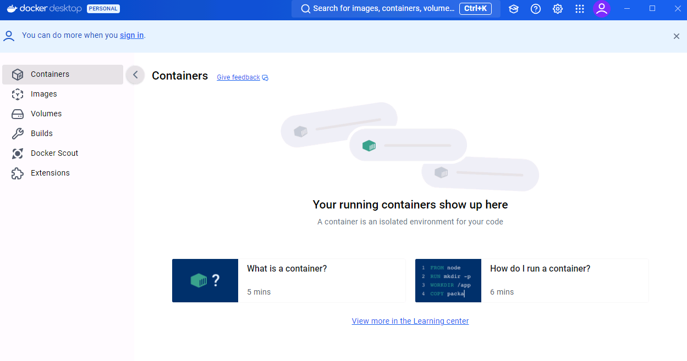
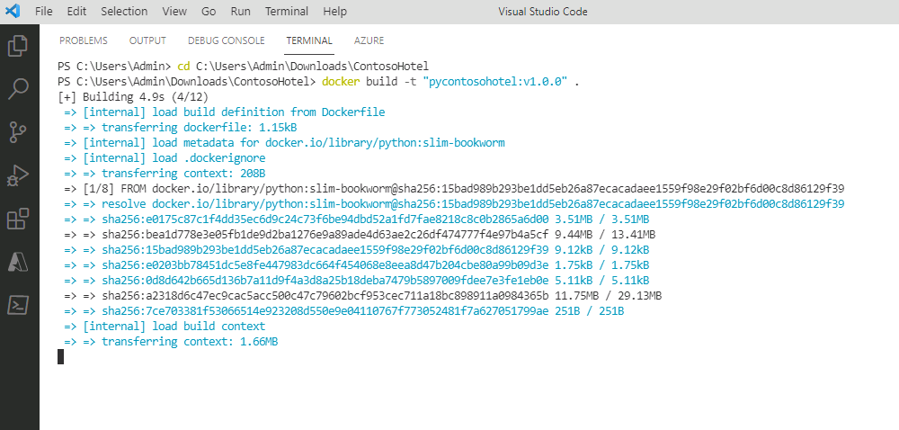

#Task 02: Build a Docker container for the app

<!--- Estimated time: 7 minutes---> 

## Introduction

You’ll run the legacy Contoso Hotel app in a Docker container. Docker is an open-source platform that automates the deployment, scaling, and management of applications. It uses containerization technology to package an application and its dependencies into a container, ensuring that it runs consistently across different environments.

## Description

In this task, you’ll create the Docker container and add app components to the container.

The key steps are as follows:

1. Launch Docker Desktop. 
1. Verify that the Docker engine is running.
1. Build a Docker container for the app.

## Success Criteria

- The Docker engine is running.
- You’ve built a Docker container for the app.

## Learning Resources

- [**Introduction to Docker containers**](https://learn.microsoft.com/en-us/training/modules/intro-to-docker-containers/ )
- [**Build a containerized web application with Docker**](https://learn.microsoft.com/en-us/training/modules/intro-to-containers/)

## Solution

<details markdown="block">
<summary>Expand this section to view the solution</summary>

1. Open **Docker Desktop**. Wait for the app to start. After the app starts, wait for the app to start Docker Engine.

    

   {: .note }
   > After Docker Engine starts, the Docker UI should resemble the following screenshot. Docker will display any running containers.

    

1. Minimize Docker Desktop but don’t close the app.

1. Enter the following command at the Visual Studio Terminal window prompt and select **Enter**. This command allows you to run commands as an administrator.

    ```
    Start-Process powershell -Verb runAs
    ```

1. In the User Account Control window that displays, select **Yes**. A PowerShell window opens.

    

1. Enter the following command at the PowerShell prompt and then select **Enter**. This command configures the Docker daemon to start automatically.

    ```
    Set-Service -Name com.docker.service -StartupType Automatic
    ```

   {: .warning }
   > The Set-Service command will fail if you’re not running PowerShell as an administrator.

1. Enter the following command at the PowerShell prompt and then select **Enter**. This command manually starts the Docker daemon.

    ```
    Start-Service -Name com.docker.service
    ```

    

1. Enter the following command at the PowerShell prompt and then select **Enter**. This command checks the status of the Docker daemon. Verify that the results show the Docker daemon is running.

    ```
    Get-Service -Name com.docker.service
    ```

    

1. Minimize the PowerShell window. Return to Visual Studio Code.

1. Modify the file path, if needed, for the following command to point to the **Downloads\ContosoHotel** folder that you created. Enter the command at the Visual Studio Code Terminal window and then select **Enter**. This command switches the context to the folder where the cloned repository resides.

    ```
    cd $PATH_TO_DOWNLOADS_FOLDER\ContosoHotel
    ```

    

1. Enter the following command at the Terminal window prompt and then select **Enter**. This command builds the container for the app. Wait while the container builds.

    ```
    docker build -t "pycontosohotel:v1.0.0" .
    ```

    

   {: .note }
   > It may take 2-3 minutes to build the container.

1. Leave Visual Studio Code open. You’ll use the tool in the next task.

</details>
