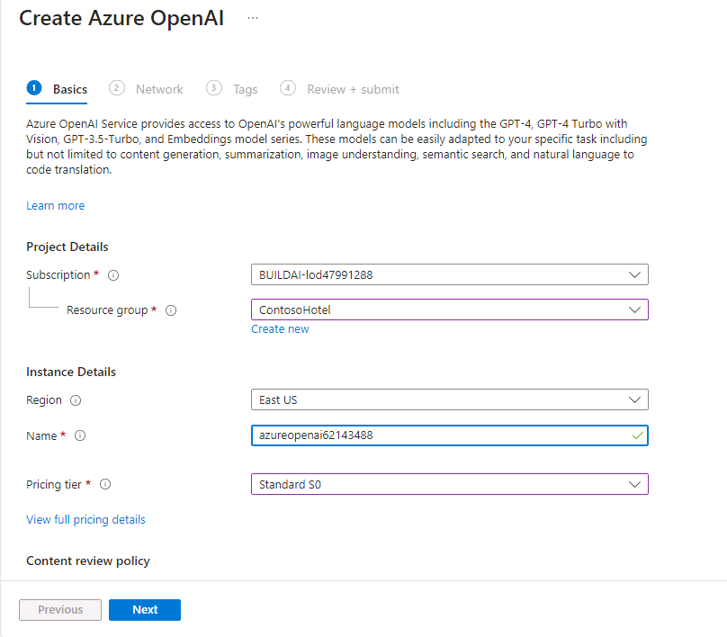
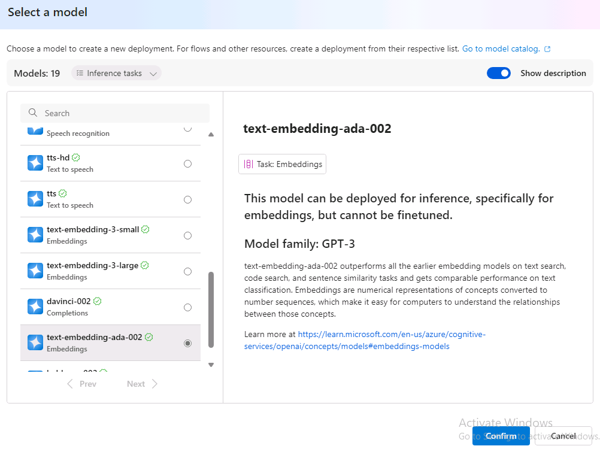
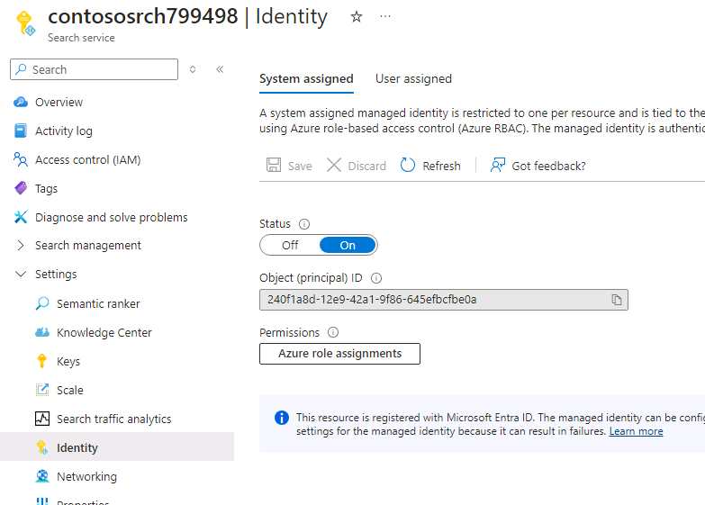
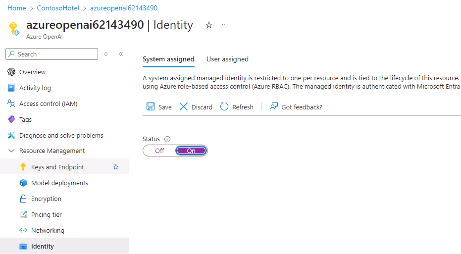
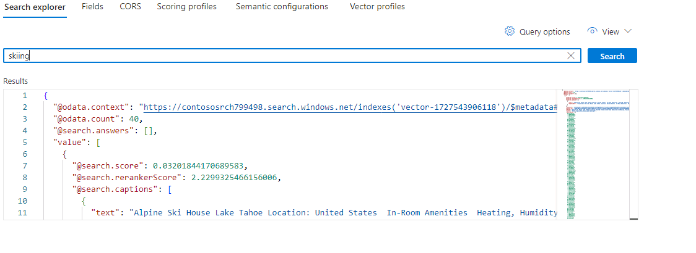

# Exercise 04 - Set up Azure resources and extract data from hotel brochures

## Lab Scenario

When people are making travel plans, they often select a hotel based on the location of the hotel or the amenities that the hotel offers. Most hotel websites make it easy to search their hotels by date and location. However, it it can be challenging to narrow down the list so that only hotels with specific amenities display.

Contoso wants to build a chatbot that helps potential guests find a hotel that meets their needs. For this solution, you will upload PDF versions of the Contoso Hotel brochures to an Azure Storage account. Then, you will use Azure Search service and Azure OpenAI service to scan the PDFs and extract information that a chatbot can use to respond to guest inquiries.

## Objectives

After you complete this lab, you will be able to:

- Create an Azure Blob Storage accountand a storage container
- Upload hotel brochures to the storage container
- Create an Azure Search Service instance
- Create an Azure OpenAI service instance and deploy models to the instance
- Configure managed identities for the services
- Extract data from the brochures and test the search index

## Exercise Duration

Estimated time to complete this exercise: *45 minutes*

---

# Task 01 - Create Azure services

<!--- Estimated time: 7 minutes---> 

## Introduction

You can use Azure Blob Storage to contain the brochures for the hotels. Storing the brochures in Azure Blob Storage ensures that the brochures are available for searching by Azure Search Service.

Azure AI services is a set of cloud-based APIs that you can use in AI applications and data flows. This lab uses Azure OpenAI Service and Azure Search Service to scan and index the data from the hotel brochures. 

Azure OpenAI services allows you to deploy a variety of large language models so that you can enhance applications by adding AI capabilities.

## Description

In this task, you will create an Azure Blog Storage account and then upload a set of PDF files to the storage account. Each PDF file is a brochure for one of the hotels represented in the Contoso Hotels app. Then, you will provision an Azure Search Service instance. Finally, you will provision an Azure OpenAI service instance and deploy models to the instance. 

The key steps are as follows:

1. Create an Azure Storage account and container.
1. Download the folder which containst the hotel brochures to your local machine.
1. Upload the brochures to the storage container.
1. Create an Azure Search Service instance.
1. Provision Azure OpenAI Service and deploy GPT-4o and Text-Embedding-ADA-002 models.


## Success Criteria

- You have uploaded the hotel brochures to the container in the Azure Storage account. 
- You have created an Azure Search Service instance.
- You have deployed GPT-4o and Text-Embedding-ADA-002 to Azure OpenAI service.

## Learning Resources

- [**Create an Azure Storage account**](https://learn.microsoft.com/en-us/training/modules/create-azure-storage-account/ )
- [**Create a storage container**](https://learn.microsoft.com/en-us/training/modules/create-azure-storage-account/5-exercise-create-a-storage-account)
- [**GitHub repository with assets for this workshop**](https://github.com/microsoft/TechExcel-Modernize-applications-to-be-AI-ready )

## Solution

<details markdown="block">
<summary>Expand this section to view the solution</summary>


1. In Visual Studio Code, enter the following commands at the Terminal window prompt. This command ensures that you are still signed in.

    ```
    az login
    ```

1. If $AZURE_REGION is not still set, update the value of the *AZURE_REGION_FROM_EX01_TASK01* variable to use the region that you selected in Exercise 01 Task 01. Then, enter the  command at the Terminal window prompt.

    ```
    $AZURE_REGION="AZURE_REGION_FROM_EX01_TASK01"
    ```

1. In Visual Studio Code, enter the following commands at the Terminal window prompt. These commands create a storage account and a storage container.
   
    ```
    $CONTOSO_STORAGE_ACCOUNT_NAME="contososa$(Get-Random -Minimum 100000 -Maximum 999999)"
    az storage account create --name $CONTOSO_STORAGE_ACCOUNT_NAME --resource-group ContosoHotel --location $AZURE_REGION --sku Standard_LRS
    az storage container create --name brochures --account-name $CONTOSO_STORAGE_ACCOUNT_NAME
    ```


1. Open a browser window and go to [**Azure portal**](https://portal.azure.com). Sign in to Azure.

1. On the Azure Home page, select **Resource groups** and then select **ContosoHotel**.

1. In the list of resources that displays, recprd the name for the Storage account that you created. You will need the name in an upcoming task.

1.  Open File Explorer on your computer and go to the Downloads folder. Update the following variable to use the path for your Downloads folder.

    ```
    $PATH_TO_DOWNLOADS_FOLDER = "C:\Users\Admin\Downloads"
    ```

1. In Visual Studio Code, enter the following commands at the Terminal window prompt. This command clones assets for this workshop including hotel brochures from a GitHub repository to a folder in your Downloads folder. 

    ```
    git clone https://github.com/microsoft/TechExcel-Modernize-applications-to-be-AI-ready "$PATH_TO_DOWNLOADS_FOLDER\AssetsRepo"
    ```

    


1. Enter the following command at the Terminal window prompt. This command uploads the brochures to the storage container that you created earlier in this task. 

    ```
    az storage blob upload-batch --account-name $CONTOSO_STORAGE_ACCOUNT_NAME --destination brochures --source "$PATH_TO_DOWNLOADS_FOLDER\AssetsRepo\Assets\PDFs" --pattern "*.pdf" --overwrite
    ```

    


1. Enter the following commands at the Terminal window prompt. These commands create the Azure Search Service instance.

    ```
    $CONTOSO_SEARCH_SERVICE_NAME="contososrch$(Get-Random -Minimum 100000 -Maximum 999999)"
    az search service create --name $CONTOSO_SEARCH_SERVICE_NAME --resource-group ContosoHotel --sku Basic --location $AZURE_REGION  --auth-options aadOrApiKey --aad-auth-failure-mode http403 --identity-type SystemAssigned
    ```

	{: .note }
	> It may take 10-15 minutes for provisioning to complete.

    

1. Open a browser window and go to [**Azure portal**](https://portal.azure.com). Sign in to Azure.

1. On the Azure Home page, select **Resource groups** and then select **ContosoHotel**.

1. In the list of resources that displays, recprd the name for the Search Service instance that you created. You will need the name in an upcoming task.

1. On the Azure Home page, select **+ Create a resource**. Search for **Azure OpenAI** and select **Azure OpenAI** in the list of search results.

1. Locate the Azure OpenAI tile. Select **Create** and then select **Azure OpenAI**.

    

1. On the *Create Azure OpenAI* page, enter the following information:

    | Setting | Value |
    |:---------|:---------|
    | Resource group   | **ContosoHotel**  |
    | Name  | **azureopenai62143490**|  
    | Pricing tier | **Standard S0** |

	{: .warning }
	> Azure will alert you if the service name is not unique. If you see an error message, add a digit or two to the service name.

     

1. Select **Next** three times and then select **Create**. Wait for the deployment to complete. 


1. When the deployment competes, select **Go to resource**.

1. Record the value for the Azure OpenAI instance name. You will use this value later in the lab.

1. On the Overview page for the OpenAI service, select **Go to Azure OpenAI Studio**.

    

1. On the Azure OpenAI Studio home page, in the left navigation pane, select **Deployments**.

    

1. On the Deployments page, select **+ Deploy model** and then select **Deploy base model**.

    

1. On the *Select a model* page, select **gpt-4o** and then select **Confirm**.

    

1. On the *Deploy model gpt-4o* page, select **Deploy**.

	{: .warning }
	> Record the value for the deployment name setting. You will use this value later in the lab.

1. Return to the Deployments page, select **+ Deploy model** and then select **Deploy base model**.

    

1. On the *Select a model* page, select **text-embedding-ada-002** and then select **Confirm**.

    

1. On the *Deploy model gpt-4o* page, change the value for the Deployment name setting to **ada** and then select **Deploy**.

	{: .warning }
	> Record the value for the deployment name setting. You will use this value later in the lab.

1. Return to the Deployments page. Verify that both models are present. 

    

1. Close the Azure OpenAI Studio page. Leave Visual Studio Code open. 

</details>


---

# Task 02 - Configure managed identities for deployed Azure resources

<!--- Estimated time: 5 minutes---> 

## Introduction

Managing permissions and access for users and Azure resources can be challenging. Managed identities help you deploy secure solutions on Azure without the need to manage credentials. You can create system-assigned and user-assigned managed identities. For this lab, you will use system-assgined managed identities. You enable this type of identity directly on the Aure resource.

## Description

In this task, you will create a set of managed identities so that the various Azure resources you created can communicate with each other.

The key steps are as follows:

1. Configure the Azure OpenAI and Azure Search instances to use system-assigned managed identities.
1. Configure a managed identity to allow the Azure Search and Azure OpenAI instances to access the Azure Blob Storage account.
1. Configure a  managed identity to allow Azure Search instance to access the Azure OpenAI Service instance.
1. Configure a  managed identity to allow Azure OpenAI Service instance to access the  Azure Search instance.

## Success Criteria

- You have configured managed identities so that the Azure Blob Storage account, Azure Search Service instance, and Azure OpenAI Service instance can communicate with each other. 

## Learning Resources

- [**Implement managed identities**](https://learn.microsoft.com/en-us/training/modules/implement-managed-identities/
)

## Solution

<details markdown="block">
<summary>Expand this section to view the solution</summary>

1. Open a browser window and go to [**Azure portal**](https://portal.azure.com). Sign in to Azure.

1. On the Azure Home page, select **Resource groups** and then select **ContosoHotel**.

1. In the list of services, select the Azure Search Service instance you created.

1. In the left navigation pane, in the Settings section, select **Identity**.

1. Set the value for the Status field on the System assgined tab to **On**.

    

1. If prompted, select **Yes** to confirm the change.

1. On the Azure Home page, select **Resource groups** and then select **ContosoHotel**.

1. In the list of services, select the Azure OpenAI resource you created.

1. In the left navigation pane, in the Resource Management section, select **Identity**.

1. Verify that the value for the Status field on the System assgined tab is set to **On**.

    

1. If prompted, select **Yes** to confirm the change.

    

1. Modify the values for the variables to reflect the names for the resources that you created in Task 01.

    ```
    $CONTOSO_SEARCH_SERVICE_NAME="ENTER_NAME_YOU_RECORDED_TASK01_STEP6"
    $CONTOSO_STORAGE_ACCOUNT_NAME="ENTER_NAME_YOU_RECORDED_TASK01_STEP13"
    $CONTOSO_AI_NAME="ENTER_NAME_YOU_RECORDED_TASK01_STEP20"
    ```

1. Enter the following commands at the Terminal window prompt. These commands allow the Azure Search and Azure OpenAI instances to access the Azure Blob Storage account.

    ```
    $SEARCH_IDENTITY=$(az search service show --name $CONTOSO_SEARCH_SERVICE_NAME --resource-group ContosoHotel --query identity.principalId -o tsv)
    $AI_IDENTITY=$(az cognitiveservices account identity show --name $CONTOSO_AI_NAME --resource-group ContosoHotel --query principalId -o tsv)
    $STORAGE_SCOPE=$(az storage account show --name $CONTOSO_STORAGE_ACCOUNT_NAME --resource-group ContosoHotel --query id -o tsv)
    az role assignment create --role "Storage Blob Data Contributor" --assignee $SEARCH_IDENTITY --scope $STORAGE_SCOPE
    az role assignment create --role "Storage Blob Data Contributor" --assignee $AI_IDENTITY --scope $STORAGE_SCOPE
    ```

1. Enter the following commands at the Terminal window prompt. These commands allow the Azure Search to access the Azure OpenAI Service instance you created.

    ```
    $AI_SCOPE=$(az cognitiveservices account show --name $CONTOSO_AI_NAME --resource-group ContosoHotel --query id -o tsv)
    az role assignment create --role "Cognitive Services OpenAI Contributor" --assignee $SEARCH_IDENTITY --scope $AI_SCOPE
    ```

1. Enter the following commands at the Terminal window prompt. These commands allow the Azure OpenAI Service instance to access the Azure Search Service instance you created.

    ```
    $SEARCH_SCOPE=$(az search service show --name $CONTOSO_SEARCH_SERVICE_NAME --resource-group ContosoHotel --query id -o tsv)
    az role assignment create --role "Search Index Data Contributor" --assignee $AI_IDENTITY --scope $SEARCH_SCOPE
    az role assignment create --role "Search Index Data Reader" --assignee $AI_IDENTITY --scope $SEARCH_SCOPE
    az role assignment create --role "Search Service Contributor" --assignee $AI_IDENTITY --scope $SEARCH_SCOPE
    ```
1. Leave Visual Studio Code open. You will run addtional commands in the next task.

</details>


---

# Task 03 - Configure Azure Search to extract data from the brochures and test the search index

<!--- Estimated time: 10 minutes---> 

## Introduction

Azure Search Service includes a wizard that allows you to import and vectorize data. You will use the wizard to extract and vectorize data from the hotel brochures. As part of the wizard, you will create an Azure OpenAI Service instance and deploy models to the instance. You will use these models later in the lab to build the chatbot that lets visitors ask questions about hotels.

## Description

In this task, you will use Azure Search to import and vectorize data from the hotel brochures. You will then test the index.

The key steps are as follows:

1. Launch the import and vectorize data and connect to Azure Blob Storage.
1. Create an Azure OpenAI Service instance and deploy models to the instance.
1. Vectorize text from the brochures.
1. Index the data.
1. Test the index.

## Success Criteria

- You have successfully completed all steps in the Import and vectorize data wizard. 
- You have deployed models to an Azure OpenAI instance.
- You have tested the search index by using Search Explorer and can view results.

## Learning Resources

- [**Azure Search Overview**](https://learn.microsoft.com/en-us/azure/search/search-what-is-azure-search)
- [**Integrated data chunking and embedding in Azure AI Search**](https://learn.microsoft.com/en-us/azure/search/vector-search-integrated-vectorization)
- [**Quickstart: Vectorize text and images by using the Azure portal**](https://learn.microsoft.com/en-us/azure/search/search-get-started-portal-import-vectors?tabs=sample-data-storage%2Cmodel-aoai%2Cconnect-data-storage)
- [**Manage your Azure AI Search service with the Azure CLI**](https://learn.microsoft.com/en-us/azure/search/search-manage-azure-cli)

## Solution

<details markdown="block">
<summary>Expand this section to view the solution</summary>

1. Open a browser window and go to [**Azure portal**](https://portal.azure.com). Sign in to Azure.

1. On the Azure Home page, select **Resource groups** and then select **ContosoHotel**.

1. In the list of resources that displays, select the Azure Search service instance from the list of resources.

1. On the Overview page for the Search service, select **Import and vectorize data**.

    

1. On the Connect to your data page, select **Azure Blob Storage**.

    

1. On the Configure your Azure Blob Storage page, enter the following information and then select **Next**. Wait while Azure validates the connection:

    | Setting | Value |
    |:---------|:---------|
    | Storage acccount   | Use the name for the storage account that you created in Exercise 04, Task 01, Step 11  |
    | Blob container   | **brochures**| 

	{: .warning }
	> The data import wizard will fail at this step if you have not uploaded any brochures to the storage container.

    

1. On the *Vectorize your text* page, enter the following information:

    | Setting | Value |
    |:---------|:---------|
    | Kind   | **Azure OpenAI**  |
    | Azure OpenAI service  | The name you recorded in Task 01 Step 20.|  
    | Model deployment | **ada** |
    |Authentication type | **System assigned identity**|

    

1. Select the checkbox to acknowledge that connecting to Azure OpenAI service will incur costs and then select **Next**. Select **Next** again to skip the Vecorize and enrich your images step.

    

1. On the *Advanced settings* page, select **Enable semantic ranker**. In the Shedule indexing drop-down list, select **Once**.

    

1. On the *Review and create* page, enter **brochures-vector** in the Objects name prefix text field and then select **Create**. Wait for the the creation process to complete and select **Close**.

    

1. In the left navigation pane for the Search Service instance, in the Search management section, select **Indexers**.

    

1. In the left navigation pane for the Search Service instance, in the Search management section, select **Indexes** and then select the index.

    

1. In the Search field, enter **Skiing** and then select **Search**.

1. Review the output from the search operation. The results should list data about skiing and should also contain a text vector.

    

1. Leave Visual Studio Code open. You will run addtional commands in the next exercise.
