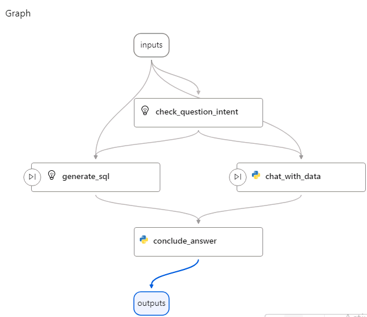
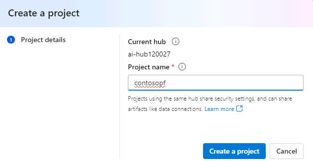
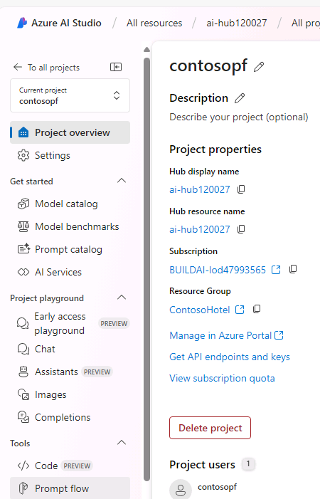
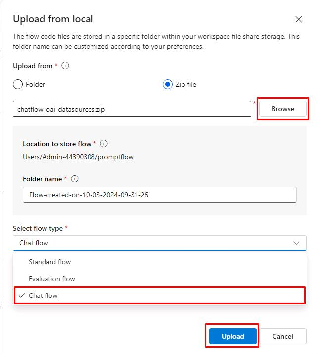
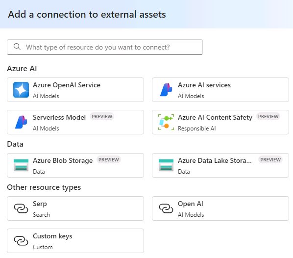
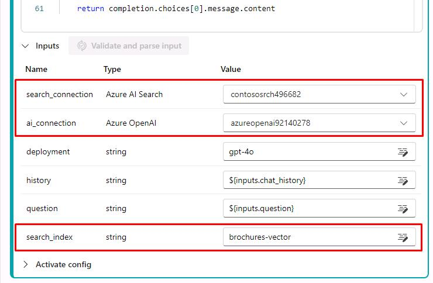
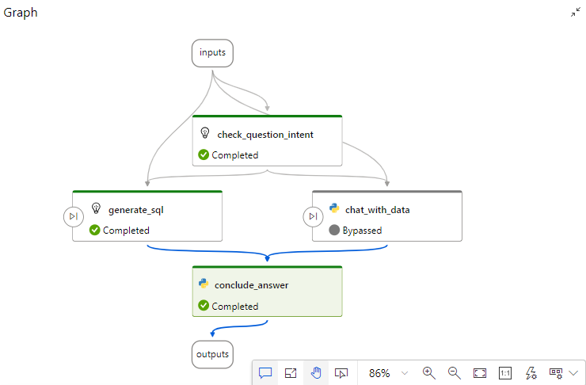

# Exercise 05 - Configure an AI Hub and Promptflow

There are a lot of ways to create a chatbot. For this lab, you will use Promptflow within Azure AI Studio. Azure OpenAI Prompt Flow is a development tool designed to streamline the entire lifecycle of AI applications powered by Large Language Models (LLMs). Prompt Flow simplifies the process of prototyping, experimenting, iterating, and deploying AI applications.

#### **What you will learn**

After completing the tasks in this exercise, you will be able to:

- Create a postgresql readonly user
- Create and configure an AI Hub instance
- Import a pre-built flow into PromptFlow
- Configure and test the flow

## Exercise Duration

* **Estimated Time:** 60 minutes

---

# Task 01 - Create a postgresql user and set up an AI Hub and PromptFlow

<!--- Estimated time: 20 minutes---> 

## Introduction

An Azure AI Studio Hub is a central resource within Azure AI Studio that helps teams manage, collaborate, and organize their AI projects. 

## Description

In this task, you will create a hub and then create a project within the hub. You will also create a PostgreSQL user so the that flow can access the database records.

The key steps are as follows:

1. Create a user for the PostgreSQL database that allows the chatbot read-only access to the Hotels, Visitors, and Bookings tables.
1. Set up and configure an AI Studio Hub.
1. Create a project in the hub.


## Success Criteria

- You have successfully created a user in the PostgreSQL database
- You have created a new AI Studio Hub and created a project

## Learning Resources

- [**Secure Azure Database for PostgreSQL**](https://learn.microsoft.com/en-us/training/modules/secure-azure-database-for-postgresql/)
- [**Develop your own custom copilots with Azure AI Studio**](https://learn.microsoft.com/en-us/training/paths/create-custom-copilots-ai-studio/)
- [**Get started with prompt flow**](https://learn.microsoft.com/en-us/training/modules/get-started-prompt-flow-ai-studio/)
- [**Prompt flow in Azure AI Studio**](https://learn.microsoft.com/en-us/azure/ai-studio/how-to/prompt-flow)
- [**Add a new connection in Azure AI Studio**](https://learn.microsoft.com/en-us/azure/ai-studio/how-to/connections-add)

## Solution

<details markdown="block">
<summary>Expand this section to view the solution</summary>

1. Open a browser window and go to [**Azure portal**](https://portal.azure.com).

1. Search for and select the PostgreSQL database that you created in a previous exercise.

    

1. On the menu bar for the database server, select **Cloud Shell** and then select **Bash** in the Clous Shell pane.

    

1. Select your subscription from the dropdown list and then select **Apply**.

1. Replace the value for *POSTGRESQL_SERVERNAME* with the Server name that appears in the Overview section for your database server. Then, enter the following commands at the Cloud Shell prompt. These commands connect to the database.

    ```
    export PGHOST="POSTGRESQL_SERVERNAME"
    export PGUSER="contosoadmin"
    export PGPORT="5432"
    export PGDATABASE="pycontosohotel"
    export PGPASSWORD="1234ABcd!"
    psql
    ```

1. Enter the following SQL statement at the Cloud Shell prompt. This statement creates a read-only user for the Promptflow chatbot:
    
    ```
    CREATE USER promptflow WITH PASSWORD '1234ABCD!';
    ```

1. Enter the following SQL statementz at the Cloud Shell prompt. These statements grant the user access to the database tables.
    
    ```
    GRANT SELECT ON TABLE hotels TO promptflow;
    GRANT SELECT ON TABLE bookings TO promptflow;
    GRANT SELECT ON TABLE visitors TO promptflow;
    GRANT EXECUTE ON FUNCTION getroomsusagewithintimespan TO promptflow;
    ```

    

1. Return to Visual Studio Code. Enter the following command at the Terminal window prompt. This command creates a unique name for an AI Hub.

    ```
    $AI_HUB_NAME="ai-hub$(Get-Random -Minimum 100000 -Maximum 999999)"
    Write-Host -ForegroundColor Green  "AI Hub name is: " $AI_HUB_NAME

    ```

    

	{: .note }
	> Record the name of the AI Hub. You will use the name later in this task.

1. Open a browser window and go to **https://ai.azure.com/**.

1. On the Azure AI Studio home page, select **Sign in**. 

    

1. If prompted, enter your credentials to sign into Azure AI Studio:

1. In the left navigation pane, in the Management section, select **All Resources**.

1. On the page that displays, select **+New hub**.

    


1. Configure the hub by using the values in the following table. Leave all other settings at their default values. Wait for the validation to complete and then select **Next**.

    | Setting | Value |
    |:---------|:---------|
    | Hub name   | Use the AI Hub name that you recorded in step 8 of this task.  |
    | Subscription  | Use the subscription where you deployed all other resources.|
    | Resource group | **ContosoHotel** |
    | Location |Enter the location for the region where you deployed all other resources**|
    | Connect Azure AI Services or OpenAI | Select the name for the OpenAI service instance that you deployed |

    
    
1. On the Review and finish page, select **Create**. 

    

1. Wait until the new AI hub, storage account, and key vault are created.

    

	{: .warning }
	> While the resources are being provisioned, take a screenshot of the page that displays. You will need to enter the AI Hub name and the Storage account name later in this task.

1. Open a browser window and go to [**Azure portal**](https://portal.azure.com).

1. In the Search field at the top of the home page, enter **Resource groups** and then select **ContosoHotel**.

1. Filter the list of resources by using the **Type** column. You should see two storage accounts. The first is the storage account that you created earlier in the lab. The other was created by the AI Hub. Select this storage account.

	{: .note }
	> The name for the newly created storage account will start with **st**. You can also use the screenshot you captured in Step 16 to identify the storage account name to use here.

1. In the left navigation pane for the storage account, select **Access Control (IAM)**.

1. On the Access Control (IAM) page, on the Grant access to this resource tile, select **Add role assignment**.

    

1. In the search field, enter **Storage Blob Data Owner** and then select **Storage Blob Data Owner** from the list of search results. Select **Next**.

    

1. On the Add role assignment page, select **+Select members**.

1. In the Select members pane, search for and select your user name.

1. Select **Select** to close the Select members pane. Then, select **Review + assign** twice.

1. On the Access Control (IAM) page, on the Grant access to this resource tile, select **Add role assignment** to add a second role assignment.

1. In the search field, enter **Storage Blob Data Reader** and then select **Storage Blob Data Reader** from the list of search results. Select **Next**.

    

1. On the Add role assignment page, select **+Select members**.

1. In the Select members pane, search for and select the name for the AI Hub that you created in Step 8 of this task.

1. Select **Select** to close the Select members pane. Then, select **Review + assign** twice.

</details>

---

# Task 02 - Import and configure a flow

<!--- Estimated time: 40 minutes---> 

## Introduction

A flow encapsulates the logic that tells the chatbot what it can do and how to do things. Creating a flow can be complicated. For this lab, you will use a pre-built flow. The flow uses the OpenAI API to directly query the Azure Search index. 

The flow collects inputs and performs several steps. The diagram below depicts the logical operations that the flow performs.



{: .note }
> AI Studio also includes an integrated vector search feature. We did not specify the use of the integrated vector search feature for this lab because we cannot deploy a flow that uses the feature to a container at this time.

## Description

In this task, you will import a pre-built flow, configure flow settings, and then test the flow.

The key steps are as follows:

1. Import a pre-built flow into the project.
1. Configure the flow.
1. Test the flow


## Success Criteria

- You have imported and configured a pre-built flow.
- You have tested the flow and confirmed that the flow returns appropriate results.

## Learning Resources

- [**Develop your own custom copilots with Azure AI Studio**](https://learn.microsoft.com/en-us/training/paths/create-custom-copilots-ai-studio/)
- [**Get started with prompt flow**](https://learn.microsoft.com/en-us/training/modules/get-started-prompt-flow-ai-studio/)
- [**Prompt flow in Azure AI Studio**](https://learn.microsoft.com/en-us/azure/ai-studio/how-to/prompt-flow)
- [**Add a new connection in Azure AI Studio**](https://learn.microsoft.com/en-us/azure/ai-studio/how-to/connections-add)

## Solution

<details markdown="block">
<summary>Expand this section to view the solution</summary>


1. Return to the Azure AI Studio browser window. 

    {: .note }
	> If you closed the window, go to [**Azure AI Studio**](ai.azure.com).

1. In the left navigation pane for the hub, select **Hub Overview**.

1. On the Overview page for the hub, locate the Projects section and select **+ New project**.

1. In the Project name field, enter **contosopf** and then select **Create a project**. Wait for the project to be created.

    

1. In the left navigation pane for the project page, in the Tools section, select **Prompt flow**.

    

1. On the *Create, iterate, and debug your orchestration flows* page, select **+Create**.

1. On the *Create a new flow* page, in the Upload from local section, select **Upload**.

    

1. On the *Upload from local* page, select **Zip file** and then select **Browse**. Go to the Downloads\AssetsRepo\Assets folder.

    {: .note } 
	> You created this folder in Exercise 04 Task 01 when you cloned the GitHub repository to acquire the hotel brochures.

1. Select **chatflow-oai-datasources..zip** and then select **Open**. 

1. Under *Select flow type*, dropdown and select **Chat flow**. Then **Upload** to import the zip file into the project. 

    

    {: .warning } 
	> It may take several minutes to upload the flow. Separately, if you receive the below error or the **Upload** button becomes available again, give it a few minutes and try again.

    

1. This will load the prompt flow once uploaded. In the middle pane for the flow, you will see one flow for each of the four logical steps in the flow. Review the information in each tile. This will help you understand how the flow functions.

1. Open a new browser window and go to [**Azure portal**](https://portal.azure.com).

1. Search for and select the PostgreSQL database that you created in a previous exercise.

    

1. In the Overview section for the database, copy the value for Server name. You will past the value into a field in Step 18 of this task.

1. In the left navigation pane for the flow, select **Settings** and then select **+ New connection**.

    

1. On the *Add a connection to external assets* page, select **Custom keys**.

    

1. Select **+ Add key value pairs**.

1. Enter the following information. 

    | Field | Value |
    |:---------|:---------|
    | Custom keys      | **hostname**   |
    | Value   | Use the server name you copied in Step 14 of this lab|

1. Select **+ Add key value pairs**.

1. Enter the following information. 

    | Field | Value |
    |:---------|:---------|
    | Custom keys      | **user**   |
    | Value   | **promptflow**|

1. Select **+ Add key value pairs**.

1. Enter the following information. 

    | Field | Value |
    |:---------|:---------|
    | Custom keys      | **port**   |
    | Value   | **5432**|

1. Select **+ Add key value pairs**.

1. Enter the following information. 

    | Field | Value |
    |:---------|:---------|
    | Custom keys      | **database**   |
    | Value   | **pycontosohotel**|

1. Select **+ Add key value pairs**.

1. Enter the following information. 

    | Field | Value |
    |:---------|:---------|
    | Custom keys      | **passwd**   |
    | Value   | **1234ABCD!**|
    | Is Secret| Selected|

1. In the Connection name field, enter **postgresql** and then select **Add connection**. Wait while the connection is created. The connection should resemble the following screenshot:

    

1. From **Settings**, select **+ New Connection** again.

1. Select **Azure AI Search**.

    

1. Select **Add connection** to the right of your Search Service.

    

1. In the left navigation pane, under the Components section, select **Deployments**, and then select your **gpt-4o** model.

    

1. Select **Edit**.

    

1. The **Tokens per Minute Rate Limit** needs to be increased from the default for the chat bot to function.

    1. Change the value to **10K**.
    1. Select **Save and close**.

    {: .warning }
	> Dragging the slider does not allow for small increments. Select the **white dot** on the slider, then use **Left/Right Arrow Keys** to change the value. 

    

1. In the left navigation pane for the flow, in the Tools section, select **Prompt flow** and then select the prompt flow that you created.

1. Select **Start compute session**. This allows you to run and test the chatbot. Continue to the next steps to finish configurations while this starts.

    

1. Locate the *check_question_intent* tile. In the *Connection* field, select the connection that displays.

    

1. Scroll down to the *chat_with_data* tile and below the *Inputs* section. 

    1. Dropdown the **Value** of *search_connection* and select your **Search Service**
    1. Dropdown the **Value** of *ai_connection* and select your **Azure OpenAI** resource
    1. Change the **Value** of *search_index* to **brochures-vector**

    

1. Scroll down to the *generate_sql* tile. In the *Connection* field, select the connection that displays.

    

1. Scroll down to the bottom of the *conclude_answer* tile. We will input a value into field that will populate after testing the next steps.

1. If the compute session has started, select **Chat** to test the flow.

    

1. Enter **Where can I ski?** in the chat prompt and press the **Enter** key. This will give you a warning and populate the postgresql property at the bottom of the *conclude_answer* tile.

    

1. Dropdown the value and select postgresql.

    

1. Select the **X** on the warning in the Chat, then send **Where can I ski?** again. Your results should resemble the following:

    
    
    

1. Start a new converstion and enter **How many free rooms do hotels in Switzerland have grouped by hotel on 2024-10-10?**. Your results should resemble the following:

    
    
    

</details>
