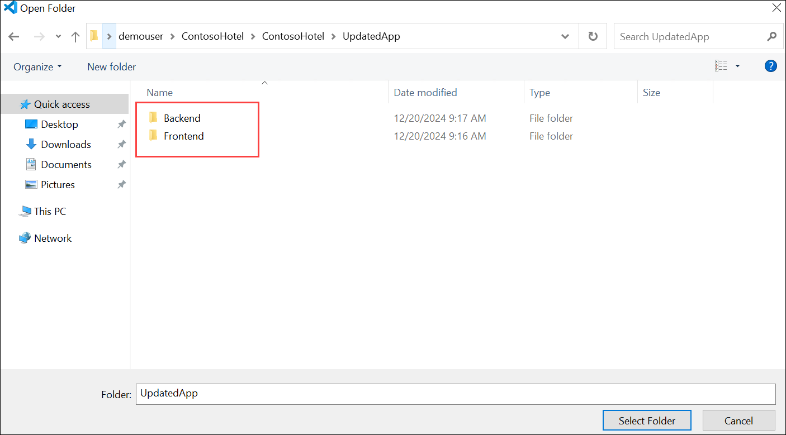
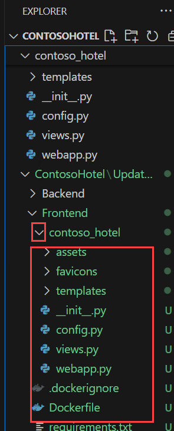
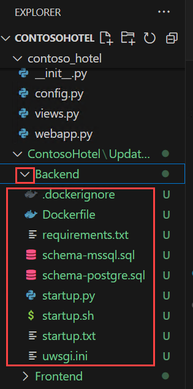

# Challenge 03: Split and repackage the Contoso Hotel app components and deploy the updated app
### Estimated Time: 60 minutes
## Introduction

To improve the scalability of the app, Contoso plans to split the front-end components (HTML, CSS, and JavaScript files) from back-end components (APIs). In this exercise you’ll split the components and refactor some code. Then, you’ll deploy the front-end and back-end components to separate containers. Finally, you’ll push the containers to ACR and run the updated app.

## Solution Guide

### Task 1: Separate front-end components from back-end components

In this task, you’ll manually separate front-end and back-end components into separate folders.

1. Open Visual Studio Code.

1. If not opened, from the top left menu, select the **(...) (1)** ellipses > **Terminal (2)**, then choose **New Terminal (3)**.

   

1. Make sure your in **ContosoHotel** folder.  

   

1. Enter the following command at the Terminal window prompt and press **Enter**. This command creates a directory for front-end components.

   ```
   mkdir -p ContosoHotel/UpdatedApp/Backend 
   ```
    

1. Enter the following command at the Terminal window prompt and press **Enter**. This command creates a directory for back-end components.

   ```
   mkdir -p ContosoHotel/UpdatedApp/Frontend
   ```
        

1. From the top left corncer menu select **File (1)** >  **Open Folder (2)**.

   

1. Naviagte to `C:\Users\demouser\ContosoHotel\ContosoHotel\UpdatedApp` in the File explorer and press **Enter**.

   

1. Verify that the subfolders that you have created are present.   

   

1. Enter the following commands at the Terminal window prompt and press **Enter**. These commands copy all necessary files to the **Frontend** folder for the updated app.   

   ```
   cp startup.* C:\Users\demouser\ContosoHotel\ContosoHotel\UpdatedApp\Frontend
   cp uwsgi.ini C:\Users\demouser\ContosoHotel\ContosoHotel\UpdatedApp\Frontend
   cp Dockerfile C:\Users\demouser\ContosoHotel\ContosoHotel\UpdatedApp\Frontend
   cp *.docker* C:\Users\demouser\ContosoHotel\ContosoHotel\UpdatedApp\Frontend
   cp requirements.txt C:\Users\demouser\ContosoHotel\ContosoHotel\UpdatedApp\Frontend
   ```
      

1. Click on the **Frontend** drop down in the explorer, you can see all the copied files  appear under **Frontend** folder.   

      

1. Enter the following commands at the Terminal window prompt and press **Enter**. These commands create a subfolder in the **Frontend** folder and copy all necessary files to subfolder.    

   ```
   cp -r C:/Users/demouser/ContosoHotel/contoso_hotel/static C:\Users\demouser\ContosoHotel\ContosoHotel\UpdatedApp\Frontend\contoso_hotel\
   cp -r C:/Users/demouser/ContosoHotel/contoso_hotel/templates C:\Users\demouser\ContosoHotel\ContosoHotel\UpdatedApp\Frontend\contoso_hotel\
   cp C:/Users/demouser/ContosoHotel/contoso_hotel/*.py C:\Users\demouser\ContosoHotel\ContosoHotel\UpdatedApp\Frontend\contoso_hotel\
   ```
       

1. Click on the **contoso_hotel** drop down under the **Frontend** folder in the Explorer. You can see the copied files.

      

1. Enter the following commands at the Terminal window prompt and press **Enter**. These commands copy all necessary files to the **Backend** folder for the updated app.    

   ```
   cp *.sql C:\Users\demouser\ContosoHotel\ContosoHotel\UpdatedApp\Backend
   cp startup.* C:\Users\demouser\ContosoHotel\ContosoHotel\UpdatedApp\Backend
   cp uwsgi.ini C:\Users\demouser\ContosoHotel\ContosoHotel\UpdatedApp\Backend
   cp *docker* C:\Users\demouser\ContosoHotel\ContosoHotel\UpdatedApp\Backend
   cp requirements.txt C:\Users\demouser\ContosoHotel\ContosoHotel\UpdatedApp\Backend
   ```
        

1. Click on the **Backend** drop down in the explorer, you can see all the copied files  appear under **Backend** folder.   

          

1. Enter the following commands at the Terminal window prompt and press **Enter**. These commands create a subfolder in the **Backend** folder and copy all necessary files to subfolder.    


   ```
   cp -r C:/Users/demouser/ContosoHotel/contoso_hotel/dblayer C:\Users\demouser\ContosoHotel\ContosoHotel\UpdatedApp\Backend\contoso_hotel\
   cp C:/Users/demouser/ContosoHotel/contoso_hotel/*.py C:\Users\demouser\ContosoHotel\ContosoHotel\UpdatedApp\Backend\contoso_hotel\
   ```
      

1. Click on the **contoso_hotel** drop down under the **Backend** folder in the Explorer. You can see the copied files.

           


