# Challenge 05: Configure an AI Hub and Promptflow
### Estimated Time: 60 minutes
## Introduction

There are a lot of ways to create a chatbot. For this Challenge, you’ll use Prompt Flow within Azure AI Studio. Azure OpenAI Prompt Flow is a development tool designed to streamline the entire lifecycle of AI applications powered by Large Language Models (LLMs). Prompt Flow simplifies the process of prototyping, experimenting, iterating, and deploying AI applications.

Here's a simple overview of each service used:

- An **Azure AI Studio Hub** is a central resource within Azure AI Studio that helps teams manage, collaborate, and organize their AI projects.
- A **flow** encapsulates the logic that tells the chatbot what it can do and how to do things. Creating a flow can be complicated. For this challenge, you’ll use a pre-built flow. The flow uses the OpenAI API to directly query the Azure Search index.

## Solution Guide

### Task 1: Create a postgresql user and set up an AI Hub and Prompt Flow

In this task, you’ll create a hub and then create a project within the hub. You’ll also create a PostgreSQL user so that the flow can access the database records.

1. On the Azure Home page, select the **PostgreSQL database** that you created in a previous Challenge.

    

1. Copy and paste the the **Server name** that appears in the **Overview** section for your database server in a notepad.

    

1. On the menu bar for the database server, select **Cloud Shell** icon.

    

1. Then select **Bash** in the Cloud Shell pane.     

    

1. Select your **Subscription** from the dropdown list **(1)** and then select **Apply (2)**.

    

1. Replace the value for P**OSTGRESQL_SERVERNAME** with the Server name that appears in the Overview section for your database server that you copied in the previous step. Then, enter the following commands at the Cloud Shell prompt an press **Enter**. These commands connect to the database.   

   ```
   export PGHOST="POSTGRESQL_SERVERNAME"
   export PGUSER="contosoadmin"
   export PGPORT="5432"
   export PGDATABASE="pycontosohotel"
   export PGPASSWORD="1234ABcd!"
   psql
   ```

    

1. Next to `pycontosohotel`, Enter the following SQL statement at the Cloud Shell prompt and press **Enter**. This statement creates a read-only user for the Prompt flow chatbot:

   ```
   CREATE USER promptflow WITH PASSWORD '1234ABCD!';
   ```

    

1. Next to `pycontosohotel`, Enter the following SQL statement at the Cloud Shell prompt and press **Enter**.These statements grant the user access to the database tables.

   ```
   GRANT SELECT ON TABLE hotels TO promptflow;
   GRANT SELECT ON TABLE bookings TO promptflow;
   GRANT SELECT ON TABLE visitors TO promptflow;
   GRANT EXECUTE ON FUNCTION getroomsusagewithintimespan TO promptflow;
   ```

    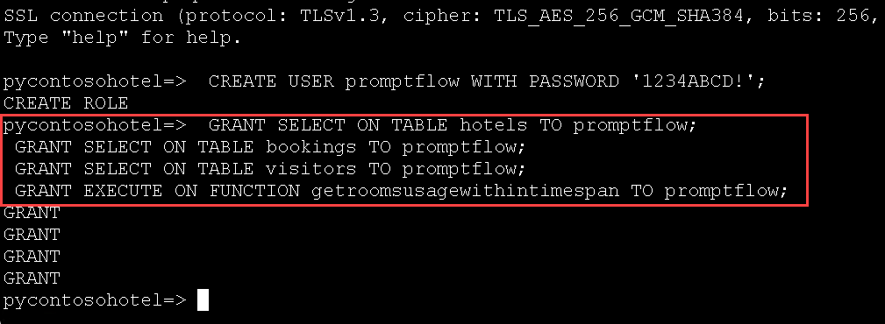

1. Return to Visual Studio Code. Enter the following command at the Terminal window prompt and press **Enter**. This command creates a unique name for an **AI Hub**.

   ```
   $AI_HUB_NAME="ai-hub$(Get-Random -Minimum 100000 -Maximum 999999)"
   Write-Host -ForegroundColor Green  "AI Hub name is: " $AI_HUB_NAME
   ```

    

     >**Note:** Record the name of the AI Hub. You’ll use the name later in this task.

1. Open a **New InPrivate window**, navigate to `https://ai.azure.com/`.     

1. Select **Sign in**. 

1. If prompted, enter your credentials to sign into Azure AI Studio:

     >**Note:** You can find the **Username** and **Password** within the environment by navigating to the **Environment** tab in the left pane.

1. Click on **+ Create project**.

    

1. Click on **Customize.**

    

1. Click on **Customize.**

    

1. On the **Create a project** page, provide the following details and then click on **Next (6)**.

    - Hub name: **Enter AI Hub name that you recorded in step 9 of this task (1)**.
    - Subscription: **Leave the default Subscription (2)**
    - Resource group: Select **Appmod (3)** from the drop down list.
    - Location: **Enter the location for the region where you deployed all other resources (4)**
    - Connect Azure AI Services or OpenAI: **Select the name for the OpenAI service instance that you deployed in challenge 01 (5)**

          

1. On the **Review and finish** page, select **Create**. 

    

1. Wait until the new AI hub, storage account, and key vault are created.

    

     >**Note:** While the resources are being provisioned, take a screenshot of the page that displays or copy and paste the resources name. *You’ll need to enter the **AI Hub** name and the **Storage account** name later in this task*. 

1. Navigate back to the **Azure portal**.

1. On the Azure Home page, select **Resource groups** and then select **Appmod**.

1. You should see two storage accounts. The first is the storage account that you created earlier in the lab. *The other was created by the AI Hub. Select the storage account that was created by AI Hub*.

    

     >**Note:** The name for the newly created storage account will start with **st**.

1. In the left navigation pane for the storage account, select A**ccess Control (IAM) (1)**. On the Access Control (IAM) page, on the **Grant access to this resource** tile, select **Add role assignment (2)**.

    

1. In the Search field, enter **Storage Blob Data Owner (1)** and then select **Storage Blob Data Owner (2)** from the list of search results. Select **Next (3)**.

    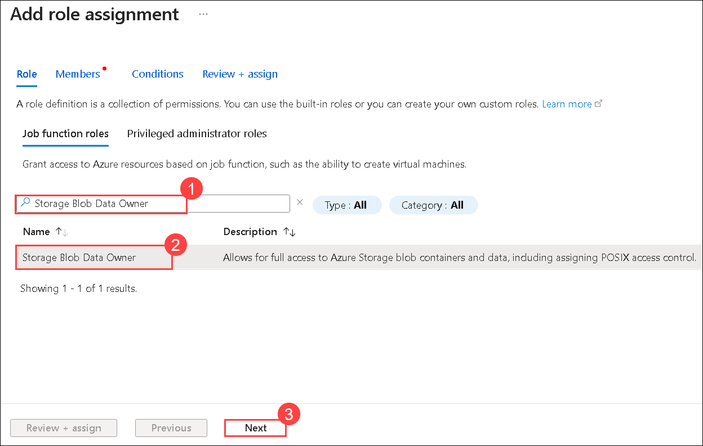

1. On the **Add role assignment** page, select **+Select members (1)**. In the Select members pane, search for your username provided in the Environment tab **(2)** and select your user name **(3)**. Select **Select (4)** to close the Select members pane.    

    

1. Then, select **Review + assign** twice.  

    

1. On the **Access Control (IAM)** page, on the **Grant access to this resource** tile, select **Add role assignment** to add a second role assignment.    

    

1. In the Search field, enter **Storage Blob Data Reader (1)** and then select **Storage Blob Data Reader (2)** from the list of search results. Select **Next (3)**.

    

1. On the **Add role assignment** page, select **+Select members (1)**. In the Select members pane, search for and select the name for the *AI Hub that you created in Step 9 of this task* **(2)(3)** and then select **Select (4)**.

    

1. Then, select **Review + assign** twice.

    


### Task 2: Import and configure a flow 

A flow encapsulates the logic that tells the chatbot what it can do and how to do things. The flow uses the OpenAI API to directly query the Azure Search index.

In this task, you’ll import a pre-built flow, configure flow settings, and then test the flow.  

1. Return to the Azure AI Studio browser window that is opend in private window.

1. Select the AI hub that you have created previously.

    

1. Scroll down and click on **+ New project** on the Hub Overview. 

    

1. Provide the Project name as **contosopf (1)** and then click on **Create (2)**.

    

1. In the left navigation pane for the project page, in the **Build and customize** section, select **Prompt flow**.

    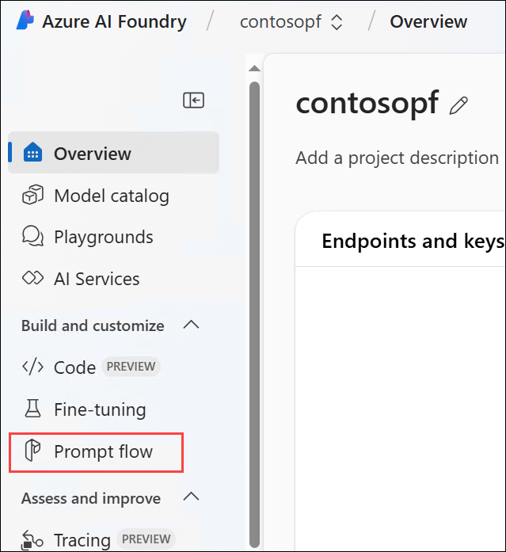

1. On the **Create, iterate, and debug your orchestration flows** page, select **+Create**.

    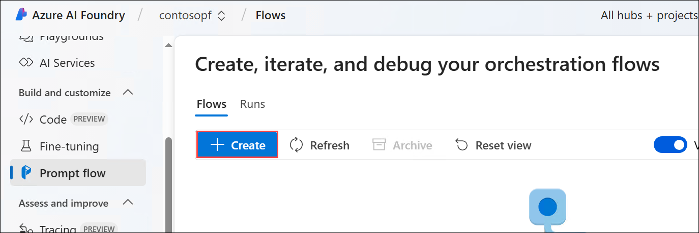

1. On the **Create a new flow** page, in the **Upload from local** section, select **Upload**.

    

1. On the **Upload from local** page, select **Zip file (1)** and then select **Browse (2)**.      

    

1. Go to the `C:/Users/demouser/AssetsRepo/Assets` folder and press **Enter.**

    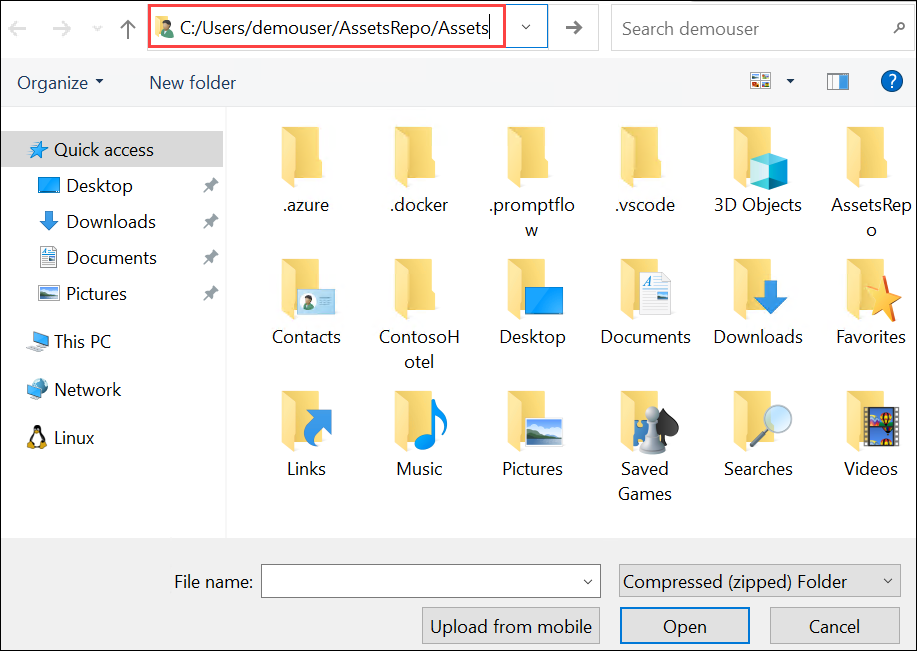

1. Select **chatflow-oai-datasources..zip (1)** and then select **Open (2)**.    

    

1. Under **Select flow** type, select **Chat flow (1)**. Then select **Upload (2)** to import the zip file into the project. 

    

     >**Note:** It may take several minutes to upload the flow. Separately, if the Upload button becomes available again, keep click on upload botton.  

1. This will load the prompt flow once uploaded. In the middle pane for the flow, you’ll see one flow for each of the four logical steps in the flow. Review the information in each tile. This will help you understand how the flow functions.

    

1. Navigate back to the **Azure portal.**

1. On the Azure Home page, select **Resource groups** and then select **Appmod**.

1. Select the PostgreSQL database that you created in a previous Challenge.

    

1. In the **Overview section** for the database, copy and paste the value for **Server name** in a notepad. You’ll pass the value into a field in Step 22 of this task. 

    

1. Return to the Azure AI Studio browser window that is opend in private window.

1. In the left navigation pane for the flow, select **Management center**.

    

1. Select **Connected resouces (1)** in the **Project(contosopf)** section and then click on **+ New connection (2)**.

    

1. On the **Add a connection to external assets** page, search for **Custom keys (1)** and select **Custom keys (2)**.    

    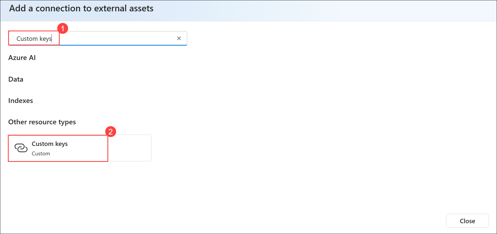

1. Select **+ Add key value pairs**.

    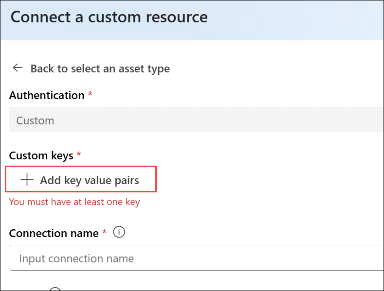

1. Enter the following information and select **+ Add key value pairs (3)**.    

    | Field | Value |
    | -- | -- |
    | Custom keys | **hostname (1)**|
    | Value | **Use the server name you copied in Step 16 of this lab (2)**|    

         

1. Enter the following information.

    | Field | Value |
    | -- | -- |
    | Custom keys | **user**|
    | Value | **promptflow**|        

1. Select **+ Add key value pairs**.

1. Enter the following information.

    | Field | Value |
    | -- | -- |
    | Custom keys | **port**|
    | Value | **5432**|          

1. Select **+ Add key value pairs**.

1. Enter the following information.

    | Field | Value |
    | -- | -- |
    | Custom keys | **database**|
    | Value | **pycontosohotel**|        

1. Select **+ Add key value pairs**.

1. Enter the following information.  

    | Field | Value |
    | -- | -- |
    | Custom keys | **passwd**|
    | Value | **1234ABCD!**| 
    | Is Secret | **Selected**|

     

1. In the *Connection name* field, enter **postgresql (1)** and then select **Add connection (2)**.

    

1. Select **+ New Connection** again.    

    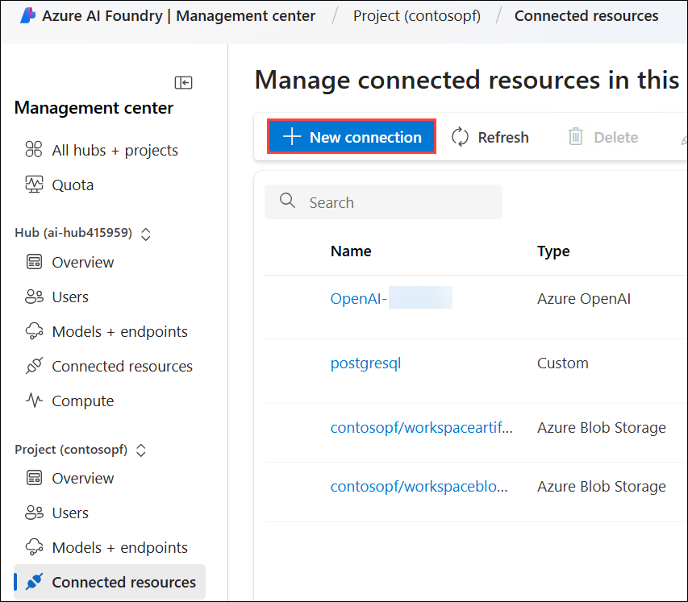

1. Select **Azure AI Search (1)** and select **Azure AI Search (2)**.

    

1. Select **Add connection** to the right of your Azure AI Search Service.    

    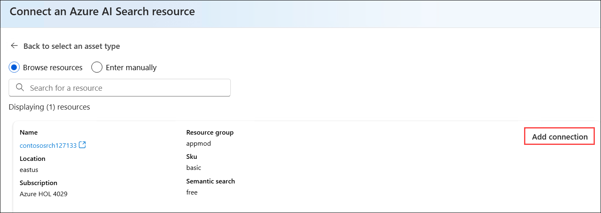

1. Click on **Close**.

    

1. In the left navigation pane, click on **Go to project.**

    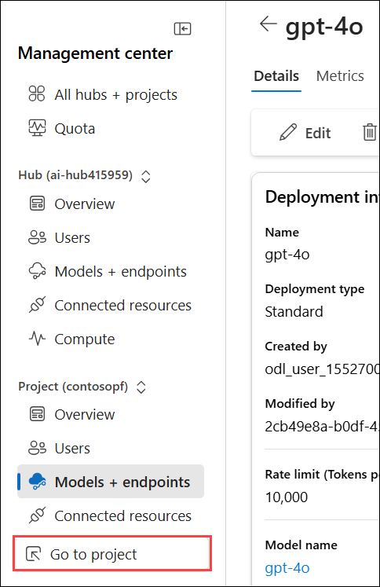

1. In the left navigation pane for the flow, in the **Build and customize** section, select **Prompt flow.** 

    

1. Select **Start compute session**. This allows you to run and test the chatbot.    

    

1. Locate the **check_question_intent** tile. Click on the  **Connection (1)** field drop down, select the connection that displays **(2)**.

    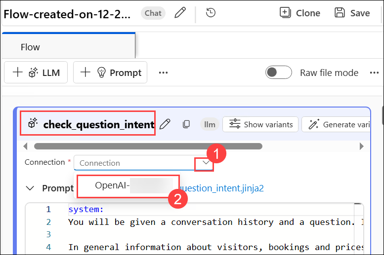

1. Scroll down to the **chat_with_data** tile and below the Inputs section.   

    - Select Value of **search_connection** and then select your Azure AI Search Service from the dropdown list **(1)**.
    - Select Value of **ai_connection** and then select your Azure OpenAI resource from the dropdown list **(2)**.
    - Change the Value of **search_index** to **brochures-vector (3)**.

      

1. Scroll down to the **generate_sql** tile. In the **Connection** field, select the connection that displays.      

    

1. Scroll down to the bottom of the **conclude_answer** tile. We’ll input a value into the field that will populate after testing the next steps. 

1. If the compute session has started, select **Chat** to test the flow.

    

1. Enter `Where can I ski?` in the chat prompt and select **Enter (1)**. This will give you a warning and *populate the PostgreSQL **(2)** property at the bottom of the* **conclude_answer** tile.    

    

1. Select **Value** of **PostgreSQL** and then select **postgresql** from the dropdown list.    

    

1. Select the **X** on the warning in the Chat.    

    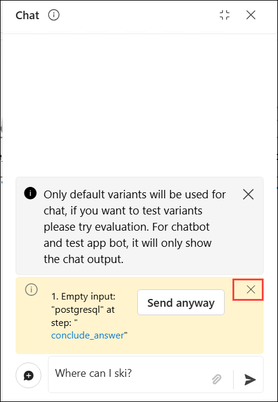

1. Then send `Where can I ski?` again. Your results should resemble the following:

    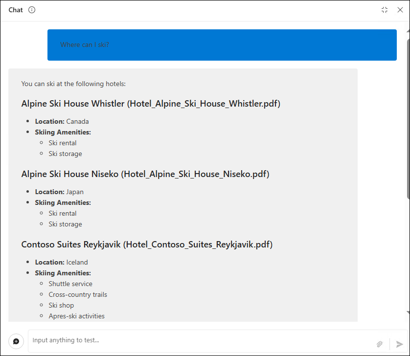

    - In the Graph,

      

1. Start a new conversation and enter `How many free rooms do hotels in Switzerland have grouped by hotel on 2024-10-10?`. Your results should resemble the following:     

    

    - In the Graph,

      


## Success Criteria:

- You’ve successfully created a user in the PostgreSQL database.
- You’ve created a new AI Studio Hub and created a project.
- You’ve imported and configured a pre-built flow.
- You’ve tested the flow and confirmed that the flow returns appropriate results.

## Additional Resources:

-  Refer to the  [Secure Azure Database for PostgreSQL](https://learn.microsoft.com/en-us/training/modules/secure-azure-database-for-postgresql/) to learn about the security features of Azure Database for PostgreSQL.
-  Refer to the  [Get started with prompt flow](https://learn.microsoft.com/en-us/training/modules/get-started-prompt-flow-ai-studio/) to learn about how to use prompt flow to develop applications that leverage language models in the Azure AI Foundry.


## Proceed with the next Challenge by clicking on **Next**>>.


