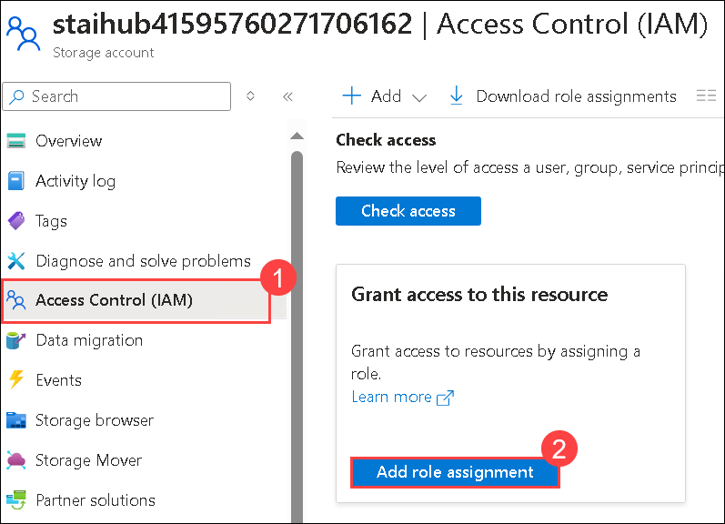

# Challenge 04: Configure an AI Hub and Promptflow
### Estimated Time: 60 minutes
## Introduction

There are a lot of ways to create a chatbot. For this Challenge, you’ll use Prompt Flow within Azure AI Studio. Azure OpenAI Prompt Flow is a development tool designed to streamline the entire lifecycle of AI applications powered by Large Language Models (LLMs). Prompt Flow simplifies the process of prototyping, experimenting, iterating, and deploying AI applications.

### Task 1: Create a postgresql user and set up an AI Hub and Prompt Flow

In this task, you’ll create a hub and then create a project within the hub. You’ll also create a PostgreSQL user so that the flow can access the database records.

1. On the Azure Home page, Search for and select the **PostgreSQL database** that you created in a previous Challenge.

    

1. Copy and paste the the **Server name** that appears in the **Overview** section for your database server in a notepad.

    

1. On the menu bar for the database server, select **Cloud Shell** icon.

    

1. Then select **Bash** in the Cloud Shell pane.     

    

1. Select your **Subscription** from the dropdown list **(1)** and then select **Apply (2)**.

    

1. Replace the value for P**OSTGRESQL_SERVERNAME** with the Server name that appears in the Overview section for your database server that you copied in the previous step. Then, enter the following commands at the Cloud Shell prompt an press **Enter**. These commands connect to the database.   

   ```
   export PGHOST="POSTGRESQL_SERVERNAME"
   export PGUSER="contosoadmin"
   export PGPORT="5432"
   export PGDATABASE="pycontosohotel"
   export PGPASSWORD="1234ABcd!"
   psql
   ```

    

1. Next to `pycontosohotel`, Enter the following SQL statement at the Cloud Shell prompt and press **Enter**. This statement creates a read-only user for the Prompt flow chatbot:

   ```
   CREATE USER promptflow WITH PASSWORD '1234ABCD!';
   ```

    

1. Next to `pycontosohotel`, Enter the following SQL statement at the Cloud Shell prompt and press **Enter**.These statements grant the user access to the database tables.

   ```
   GRANT SELECT ON TABLE hotels TO promptflow;
   GRANT SELECT ON TABLE bookings TO promptflow;
   GRANT SELECT ON TABLE visitors TO promptflow;
   GRANT EXECUTE ON FUNCTION getroomsusagewithintimespan TO promptflow;
   ```

    

1. Return to Visual Studio Code. Enter the following command at the Terminal window prompt and press **Enter**. This command creates a unique name for an **AI Hub**.

   ```
   $AI_HUB_NAME="ai-hub$(Get-Random -Minimum 100000 -Maximum 999999)"
   Write-Host -ForegroundColor Green  "AI Hub name is: " $AI_HUB_NAME
   ```

    

     >**Note:** Record the name of the AI Hub. You’ll use the name later in this task.

1. Open a **New InPrivate window**, navigate to `https://ai.azure.com/`.     

1. Select **Sign in**. 

1. If prompted, enter your credentials to sign into Azure AI Studio:

     >**Note:** You can find the **Username** and **Password** within the environment by navigating to the **Environment** tab in the left pane.

1. Click on **+ Create project**.

    

1. Click on **Customize.**

    

1. Click on **Customize.**

    

1. On the **Create a project** page, provide the following details and then click on **Next (6)**.

    - Hub name: **Enter AI Hub name that you recorded in step 9 of this task (1)**.
    - Subscription: **Leave the default Subscription (2)**
    - Resource group: Select **Appmod (3)** from the drop down list.
    - Location: **Enter the location for the region where you deployed all other resources (4)**
    - Connect Azure AI Services or OpenAI: **Select the name for the OpenAI service instance that you deployed in challenge 01 (5)**

          

1. On the **Review and finish** page, select **Create**. 

    

1. Wait until the new AI hub, storage account, and key vault are created.

    

     >**Note:** While the resources are being provisioned, take a screenshot of the page that displays or copy and paste the resources name. *You’ll need to enter the AI Hub name and the Storage account name later in this task*. 

1. Navigate back to the **Azure portal**.

1. On the Azure Home page, select **Resource groups** and then select **Appmod**.

1. You should see two storage accounts. The first is the storage account that you created earlier in the lab. *The other was created by the AI Hub. Select the storage account that was created by AI Hub*.

    

     >**Note:** The name for the newly created storage account will start with **st**.

1. In the left navigation pane for the storage account, select A**ccess Control (IAM) (1)**. On the Access Control (IAM) page, on the **Grant access to this resource** tile, select **Add role assignment (2)**.

    

1. In the Search field, enter **Storage Blob Data Owner (1)** and then select **Storage Blob Data Owner (2)** from the list of search results. Select **Next (3)**.

    

1. On the **Add role assignment** page, select **+Select members (1)**. In the Select members pane, search for your username provided in the Environment tab **(2)** and select your user name **(3)**. Select **Select (4)** to close the Select members pane.    

    

1. Then, select **Review + assign** twice.  

    

1. On the **Access Control (IAM)** page, on the **Grant access to this resource** tile, select **Add role assignment** to add a second role assignment.    

    

1. In the Search field, enter **Storage Blob Data Reader (1)** and then select **Storage Blob Data Reader (2)** from the list of search results. Select **Next (3)**.

    

1. On the **Add role assignment** page, select **+Select members (1)**. In the Select members pane, search for and select the name for the *AI Hub that you created in Step 9 of this task* **(2)(3)** and then select **Select (4)**.

    

1. Then, select **Review + assign** twice.

    


